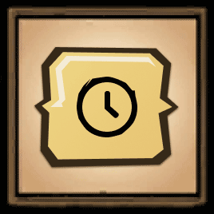

# dst-mod-auto-join

## Overview

Mod for the game [Don't Starve Together][] which is available through the
[Steam Workshop][]. It was made for those who are tired of pressing the "Join"
button over and over again in an attempt to join the full server while "hunting"
for the free slot.

It adds an "Auto-Join" button next to the original "Join" to continuously
reconnect to the selected server until joining. Now you can finally stop
"zombie-clicking" and focus on the more important stuff!

## Configuration

Don't like the default behaviour? Choose your own configuration to match your
needs:

| Configuration                  | Default     | Description                                                            |
| ------------------------------ | ----------- | ---------------------------------------------------------------------- |
| **Waiting time**               | _15s_       | The time between reconnection attempts                                 |
| **Indicator**                  | _Enabled_   | When enabled, adds a corner indicator on the supported screens         |
| **Indicator position**         | _Top Right_ | Indicator position on the screen                                       |
| **Indicator padding**          | _10_        | Indicator padding from the screen edges                                |
| **Indicator scale**            | _1.3_       | Indicator scale on the screen                                          |
| **Rejoin key**                 | _Ctrl_      | Key used for toggling the rejoin functionality                         |
| **Rejoin initial wait**        | _3s_        | Initial wait in seconds to retrieve a list of servers before rejoining |
| **Rejoin main screen button**  | _Enabled_   | When enabled, adds "Rejoin" button in the multiplayer main screen      |
| **Rejoin pause screen button** | _Enabled_   | When enabled, adds "Rejoin" button in the pause screen                 |
| **Hide changelog**             | _Enabled_   | When enabled, hides the changelog in the mod description               |
| **Debug**                      | _Disabled_  | When enabled, displays debug data in the console                       |

## Documentation

The [LDoc][] documentation generator has been used for generating documentation,
and the most recent version can be found here:
https://docs.dstmodders.com/auto-join/

## License

Released under the [MIT License](https://opensource.org/licenses/MIT).

[don't starve together]: https://www.klei.com/games/dont-starve-together
[ldoc]: https://stevedonovan.github.io/ldoc/
[steam workshop]: https://steamcommunity.com/sharedfiles/filedetails/?id=1903101575
